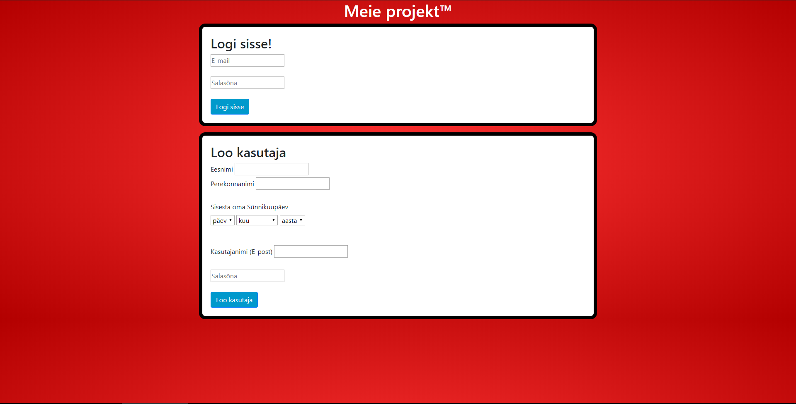
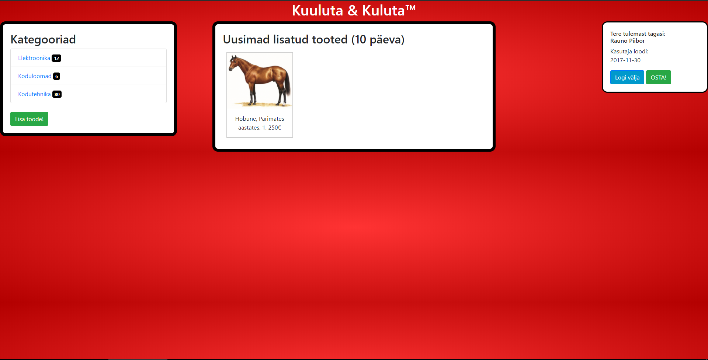
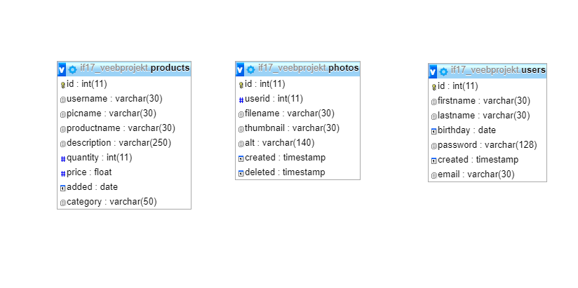

Kuuluta&kuluta

Rühma liikmed: Simon Berner, Taavi Meinberg, Edgar Johannes Trumm, Rauno Piibor
 
Login page.
 
 
 
Main page.

Meie rühmatöö eesmärk on luua veeebileht, et inimestel oleks veebileht kus enda kuulutusi lisada. Selline lähenemine propageerib kasutatud asjade kasutamist, mitte uue ostmist. 

Sihtrühmaks on kuulutuslehte vajavad inimesed igas vanuses. Meie leht on hästi organiseeritud ning on tehtud kasutajasõbralikuks. Samuti ei piira me kedagi vanusepiiranguga.

Funktsionaalsus:
1.	Saab luua kasutaja.
2.	Saab sisse logida.
3.	Pealehele kuvatakse viimase 10 päeva lisatud kuulutused.
4.	Saab kategooriate all vaadata kõiki lisatud kuulutusi.
5.	Pealehel saab lisada uusi kuulutusi.
6.	Saab vaadata millal on kasutaja loodud.
7.	Saab välja logida.

 
Andmebaaside baas

Kokkuvõte
	
	Projekti jooksul õppimisime veebilehe koostamist ja sellega seonduvat. Saime uusi teadmisi veebilehe disainis ning kinnistasime õpitut luues ise täiesti oma veebilehe. Kindlasti arendasime ka meeskonnatööd. 

Veebilehe aadress: http://greeny.cs.tlu.ee/~meintaav/projekt/projekt/index.php
